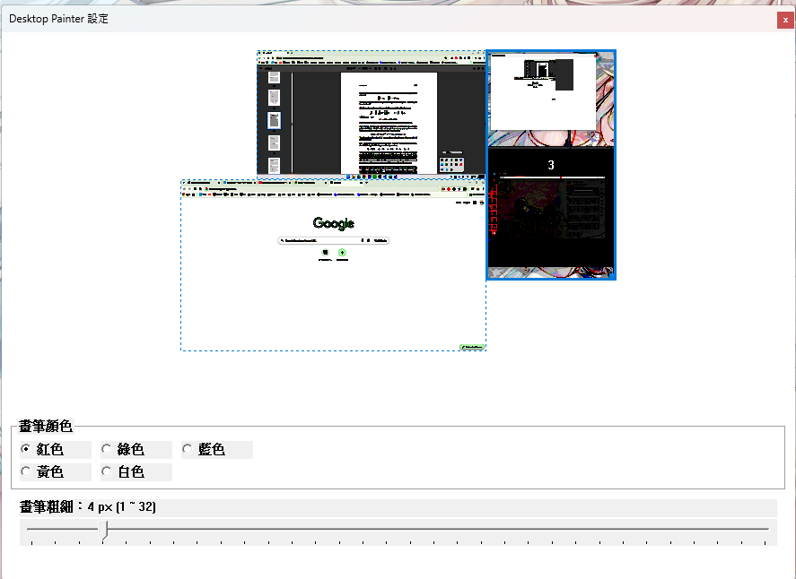

# DesktopPainter

DesktopPainter 是一個覆蓋在螢幕上的透明白板工具，可用於分享螢幕時的即時講解，或作為平時推導與計算的桌面草稿紙。無需儲存、不打斷工作流程，可隨時開啟、隨時清空。

---

## 功能概要

### 1. 透明白板
- 在指定螢幕上建立全透明 overlay。
- 可用滑鼠或繪圖板直接手寫畫線與標記。
- 不儲存內容，換螢幕或清除後即重置。

### 2. 畫筆與橡皮擦
- 左鍵：畫筆  
- 右鍵：橡皮擦  
- 筆刷設定：
  - 顏色可選（紅、綠、藍、黃、白）
  - 粗細 1–32 px
- 螢幕右下角提供 Pen / Eraser 浮動按鈕，可用繪圖板直接切換工具。

### 3. 多螢幕支援
- Config 視窗會顯示螢幕縮圖，包含相對位置。
- 點選縮圖即可切換白板所在螢幕。
- 切換時畫面會清空（設計為臨時白板）。

### 4. 系統匣功能
- 顯示畫布  
- 清除畫面  
- 開啟設定視窗  
- 顯示畫布位置（顯示一個淡出提示框）  
- 結束程式  

### 5. 快捷鍵
- **Ctrl + Alt + D**：切換「畫圖模式 / 滑鼠穿透模式」。  
  - 畫圖模式：可手寫、畫線  
  - 穿透模式：滑鼠可直接點擊底層應用程式  

---

## Config 說明（此處可放你的截圖）

設定內容包括：

- 多螢幕縮圖（點擊以切換白板所在螢幕）
- 畫筆顏色
- 畫筆粗細（trackbar 1–32 px）

---

## 使用情境

- 線上會議或實體投影時，用作即時白板標示流程、重點與示意圖。
- 進行演算法推導、控制計算、草稿數學時，用作快速計算紙。
- 閱讀程式碼或文件時，可在桌面上臨時手寫補充與草稿。

---

## 設計原則

- 不儲存內容（像真實白紙）。
- 開啟快速、不干擾目前工作流程。
- 適合作為臨時計算紙與講解白板，而非正式筆記工具。
